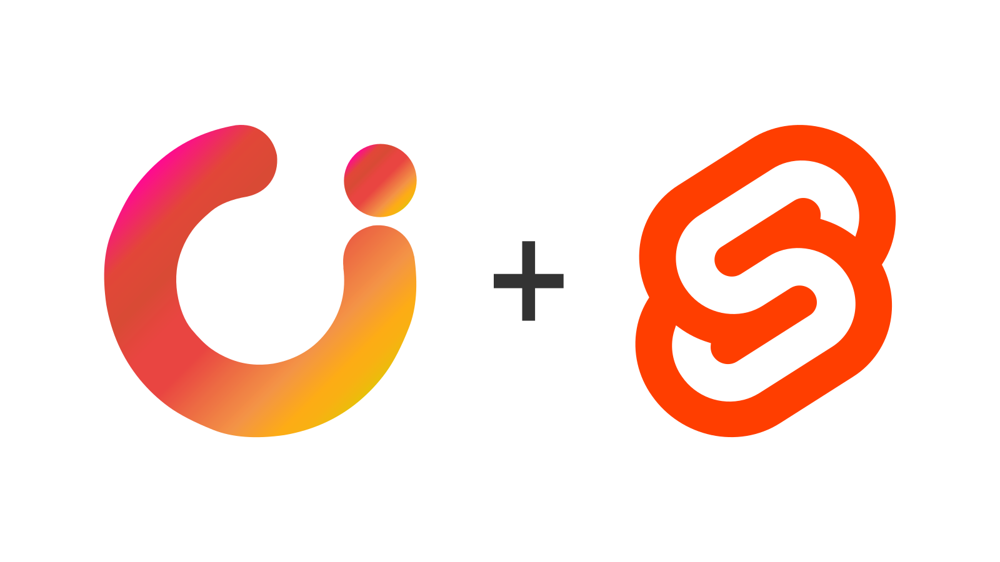

<h1 align="center">Svelte 5 Component Library by TheUI</h1>
<div align="center">

  [](https://www.npmjs.com/package/theui-sveltekit)
  [](https://www.npmjs.com/package/theui-sveltekit)
  [](https://github.com/mbparvezme/theui-sveltekit/blob/master/license.md)
  <!-- [](https://www.npmjs.com/package/theui-sveltekit) -->
</div>

<h2 align="center">A tool for the <b>Svelte eco-system</b></h2>

<div align="center">
  
</div>

The **theui-svelte** is [**TheUI**](https://www.theui.dev)'s component library for [**Svelte 5**](https://svelte.dev), built on top of TailwindCSS. It combines the strength of Svelte and the features of TailwindCSS to create a powerful tool that accelerates your development process.

<br>

## **1. Features**
- Built with ARIA roles and WCAG compliance for better usability.
- Highly customizable
- Support LTR/RTL.
- Easy theming, branding, and dark/light mode control.
- Optimized for leveraging svelte's reactivity
- Includes smooth transitions and animations for better user experience.
- Fully typed for enhanced development
- Offers examples, and usage guides tailored for Svelte.

<br>

## **2. Components**

Last but not least, here is the list of components available in the component library!


<table style="width: 100%;">
  <thead style="width: 100%;">
    <tr>
      <th colspan="2">Components</th>
    </tr>
  </thead>
  <tbody style="width: 100%;">
    <tr>
      <td><a href="https://www.theui.dev/docs/accordion">Accordion</a></td>
      <td><a href="https://www.theui.dev/docs/alert">Alert</a></td>
    </tr>
    <tr>
      <td><a href="https://www.theui.dev/docs/badge">Badge</a></td>
      <td><a href="https://www.theui.dev/docs/breadcrumb">Breadcrumb</a></td>
    </tr>
    <tr>
      <td><a href="https://www.theui.dev/docs/button">Button</a></td>
      <td><a href="https://www.theui.dev/docs/button-group">Button group</a></td>
    </tr>
    <tr>
      <td><a href="https://www.theui.dev/docs/quick-action-button">Quick action button</a></td>
      <td><a href="https://www.theui.dev/docs/card">Card</a></td>
    </tr>
    <tr>
      <td><a href="https://www.theui.dev/docs/chips">Chips</a></td>
      <td><a href="https://www.theui.dev/docs/collapse">Collapse</a></td>
    </tr>
    <tr>
      <td><a href="https://www.theui.dev/docs/drawer">Drawer</a></td>
      <td><a href="https://www.theui.dev/docs/dropdown">Dropdown</a></td>
    </tr>
    <tr>
      <td><a href="https://www.theui.dev/docs/list-group">List group</a></td>
      <td><a href="https://www.theui.dev/docs/modal">Modal</a></td>
    </tr>
    <tr>
      <td><a href="https://www.theui.dev/docs/navbar">Navbar</a></td>
      <td><a href="https://www.theui.dev/docs/notification">Notification</a></td>
    </tr>
    <tr>
      <td><a href="https://www.theui.dev/docs/pagination">Pagination</a></td>
      <td><a href="https://www.theui.dev/docs/popover">Popover</a></td>
    </tr>
    <tr>
      <td><a href="https://www.theui.dev/docs/popup">Popup (Exit and Entry popup)</a></td>
      <td><a href="https://www.theui.dev/docs/progress-bar">Progress bar</a></td>
    </tr>
    <tr>
      <td><a href="https://www.theui.dev/docs/slider">Slider</a></td>
      <td><a href="https://www.theui.dev/docs/table">Table</a></td>
    </tr>
    <tr>
      <td><a href="https://www.theui.dev/docs/tabs">Tabs</a></td>
      <td><a href="https://www.theui.dev/docs/tooltip">Tooltip</a></td>
    </tr>
  </tbody>
</table>

<br>

<table style="width: 100%;">
  <thead style="width: 100%;">
    <tr>
      <th colspan="2">Form controls</th>
    </tr>
  </thead>
  <tbody style="width: 100%;">
    <tr>
      <td><a href="https://www.theui.dev/docs/form">Form</a></td>
      <td><a href="https://www.theui.dev/docs/check-box">Check-box</a></td>
    </tr>
    <tr>
      <td><a href="https://www.theui.dev/docs/fieldset">Fieldset</a></td>
      <td><a href="https://www.theui.dev/docs/radio-button">Radio button</a></td>
    </tr>
    <tr>
      <td><a href="https://www.theui.dev/docs/label">Label</a></td>
      <td><a href="https://www.theui.dev/docs/file-input">File input</a></td>
    </tr>
    <tr>
      <td><a href="https://www.theui.dev/docs/input">Text input</a></td>
      <td><a href="https://www.theui.dev/docs/toggle">Toggle</a></td>
    </tr>
    <tr>
      <td><a href="https://www.theui.dev/docs/select">Select</a></td>
      <td><a href="https://www.theui.dev/docs/helper-text">Helper text</a></td>
    </tr>
  </tbody>
</table>

<br>

<table style="width: 100%;">
  <thead style="width: 100%;">
    <tr>
      <th colspan="2">Utilities</th>
    </tr>
  </thead>
  <tbody style="width: 100%;">
    <tr>
      <td><a href="https://www.theui.dev/docs/container">Container</a></td>
      <td><a href="https://www.theui.dev/docs/dark-mode">Dark mode</a></td>
    </tr>
    <tr>
      <td><a href="https://www.theui.dev/docs/close">Close</a></td>
      <td><a href="https://www.theui.dev/docs/svg-icon">SVG</a></td>
    </tr>
  </tbody>
</table>

<br>

## **3. Installation Guide**
To add the Svelte Components library to your project, you can do it in two ways:
1. Use the boilerplate from GitHub.
2. Manual installation from scratch.

<br>

### **3.1 Install using boilerplate from GitHub**

To install the starter template, clone <a href="https://github.com/mbparvezme/theui-svelte-starter" target="_blank">this Github repo</a> using the following commands, replacing **my-app** with your desired project name.

```bash
# Clone the project
git clone https://github.com/mbparvezme/theui-svelte-starter.git my-app

# Install node modules
npm i

# Run the application
npm run dev
```

<br>

### **3.2. Manually Install from Scratch**

Easily add theui-svelte to your project via a GitHub boilerplate or manual installation. For manual setup:

- Install SvelteKit with TailwindCSS.
- Configure Tailwind CSS by updating the <code>./src/app.css</code> file..

### **a. Install Sveltekit with TailwindCSS**

```bash
# Install Svelte
npx sv create my-app
cd my-app

# Install node modules
npm i

# Install theui-svelte
npm i theui-svelte
```

<br>

#### **b. Configuration**
To integrate  <code>theui-svelte</code> with your project, add the following lines to your <code>./src/app.css</code> file.

```diff
     @import 'tailwindcss';
+    @import 'theui-svelte/style';
+    @source "../node_modules/theui-svelte";
```

And that's all. You are ready to start your awesome project now.

<br>

## **The z-index**
This library leverages z-index for stacking elements. Avoid modifying z-index values to prevent layout disruptions.

Z-index helps in managing the stacking order of elements and overlays, controlling their arrangement along the z-axis. It is not recommended to customize these values in the design, as doing so may disrupt the layout along the z-axis.

| COMPONENT/Property | CLASS/Selector            | VALUE (Z-INDEX) |
| ------------------ | ------------------------- | --------------- |
| Dropdown           | .dropdown .backdrop       | 10              |
| Dropdown           | .dropdown-content         | 11              |
| Sticky positioned  | .sticky, [class$=:sticky] | 20              |
| Fixed positioned   | .fixed, [class$=:fixed]   | 30              |
| Offcanvas          | .offcanvas                | 40              |
| Modal              | .modal                    | 50              |
| Popup              | .popup                    | 60              |
| Tooltip            | .tooltip                  | 70              |
| Notifications      | .notifications            | 80              |

<br>

## **Contributions**

Prior to commencing work on new features or bug fixes, kindly inform us. If you wish to propose a new feature, please create a feature request in [Github Issues](https://github.com/mbparvezme/theui-svelte/issues). This promotes open discussions and avoids redundant efforts. It encompasses tasks like adding new components, introducing utility features, and making major changes to existing work.

<br>

## **Copyright**

The code and documentation are copyright 2023 by [M B Parvez](https://www.mbparvez.me), [Gosoft](https://www.gosoft.io) and [The UI](https://www.theui.dev).

<br>

## **License**

Permission is hereby granted, free of charge, to any person obtaining a copy of this software and associated documentation files (the "Software"), to deal in the Software without restriction, including without limitation the rights to use, copy, modify, merge, publish, distribute, sublicense, and/or sell copies of the Software, and to permit persons to whom the Software is furnished to do so, subject to the following conditions:

The above copyright notice and this permission notice shall be included in all copies or substantial portions of the Software.

THE SOFTWARE IS PROVIDED "AS IS", WITHOUT WARRANTY OF ANY KIND, EXPRESS OR IMPLIED, INCLUDING BUT NOT LIMITED TO THE WARRANTIES OF MERCHANTABILITY, FITNESS FOR A PARTICULAR PURPOSE AND NONINFRINGEMENT. IN NO EVENT SHALL THE AUTHORS OR COPYRIGHT HOLDERS BE LIABLE FOR ANY CLAIM, DAMAGES OR OTHER LIABILITY, WHETHER IN AN ACTION OF CONTRACT, TORT OR OTHERWISE, ARISING FROM, OUT OF OR IN CONNECTION WITH THE SOFTWARE OR THE USE OR OTHER DEALINGS IN THE SOFTWARE.

<br>

---

<br>

<h2 style="border:0;margin-bottom:0">

**Special Thanks To [Gosoft.io](https://www.gosoft.io) and [BIPBY Digital](https://www.bipby.digital) for being our digital partner**</h2>