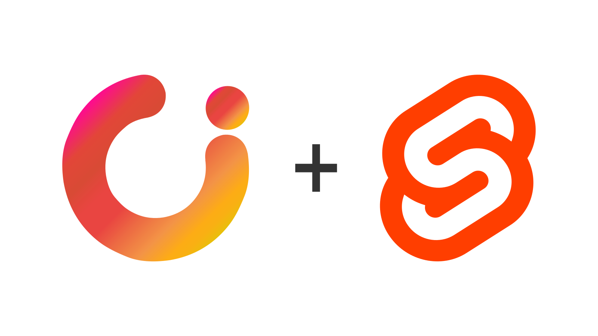

<h1 align="center">Svelte 5 Component Library by TheUI</h1>
<div align="center">

  [](https://github.com/mbparvezme/theui-svelte/actions/workflows/ci.yml)
  [](https://www.npmjs.com/package/theui-svelte)
  [](https://www.npmjs.com/package/theui-svelte)
  [](https://github.com/mbparvezme/theui-svelte/issues)

</div>

<h2 align="center">A tool for the <b>Svelte eco-system</b></h2>

<div align="center">
  
</div>

The **theui-svelte** is [**TheUI**](https://www.theui.dev)'s component library for [**Svelte 5**](https://svelte.dev), built on Tailwind CSS v4. The components carry their own ARIA wiring and keyboard behavior, read your brand colors from your CSS, and merge any class you pass with tailwind-merge, so overriding a default does not mean fighting it.

<br>

## **1. Features**
- ARIA roles, keyboard support and focus handling in every component.
- Every component takes a `class`, merged with tailwind-merge, so your classes win.
- Left to right and right to left layouts, from one stylesheet.
- Brand colors and dark mode set from your own CSS variables.
- Written with Svelte 5 runes and snippets.
- Transitions with a speed you set per component or once for the whole library.
- Fully typed, with every exported type documented.
- An example and a usage guide for every component.
- `npx theui ai` points your coding assistant at the library's own rules, so it
  gets the composition right.

<br>

### **Using an AI coding assistant?**

Once the library is installed, switch it on from your project root:

```bash
npx theui ai
```

The package carries [`AGENTS.md`](./AGENTS.md) at its root: the install steps, the
shared prop contract, how the compound families fit together, and the behaviours that
are easy to get wrong. Agents read their rules from a **project root**, though, not
from inside `node_modules` - so that command finds the instruction files your tools
already use and writes a short block into each one naming the path to those rules.

It reports back what it touched:

```
  theui-svelte · AI rules

  ✓ AGENTS.md                        created    the AGENTS.md standard
  ✓ CLAUDE.md                        updated    Claude Code
  ✓ .github/copilot-instructions.md  updated    GitHub Copilot

  Your agent now reads node_modules/theui-svelte/AGENTS.md.
```

A pointer, not a copy: it cannot overwrite rules you already wrote, and upgrading the
library upgrades what your agent reads. The block sits between HTML comment markers,
so re-running replaces it and deleting it removes every trace.

```bash
npx theui ai --dry     # show what would change, write nothing
npx theui ai --copy    # put the rules in .theui-svelte/ so they can be committed
npx theui ai --help
```

**Or wire it up by hand.** One line in the file your tool already reads does the same
job:

```md
Read node_modules/theui-svelte/AGENTS.md before using a theui-svelte component.
```

| Tool | Where its instructions live |
| --- | --- |
| Codex, Cursor, Copilot, Windsurf, Zed, Junie, Jules | `AGENTS.md` in the project root |
| Claude Code | `CLAUDE.md` - add `@node_modules/theui-svelte/AGENTS.md` to it |
| Copilot in VS Code | `.github/copilot-instructions.md` |
| Cursor, for path-scoped rules | `.cursor/rules/*.mdc` (plain `.md` is ignored) |
| Gemini CLI | `GEMINI.md` |
| Aider | a `read:` entry in `.aider.conf.yml` |

Claude Code is the one that needs the explicit entry: it falls back to `AGENTS.md` only
when no `CLAUDE.md` exists in the directory or above it, so a project with a `CLAUDE.md`
never sees the file on its own.

The documentation is served as Markdown as well, for tools that fetch URLs:
[the index](https://www.theui.dev/svelte/llms.txt), [everything in one
file](https://www.theui.dev/svelte/llms-full.txt), or any single page by appending
`.md` - `www.theui.dev/docs/button.md`.

<br>

## **2. Components**

Last but not least, here is the list of components available in the component library!


<table style="width: 100%;">
  <thead style="width: 100%;">
    <tr>
      <th colspan="2">Components</th>
    </tr>
  </thead>
  <tbody style="width: 100%;">
    <tr>
      <td><a href="https://www.theui.dev/docs/accordion">Accordion</a></td>
      <td><a href="https://www.theui.dev/docs/alert">Alert</a></td>
    </tr>
    <tr>
      <td><a href="https://www.theui.dev/docs/avatar">Avatar</a></td>
      <td><a href="https://www.theui.dev/docs/badge">Badge</a></td>
    </tr>
    <tr>
      <td><a href="https://www.theui.dev/docs/breadcrumb">Breadcrumb</a></td>
      <td><a href="https://www.theui.dev/docs/button">Button</a></td>
    </tr>
    <tr>
      <td><a href="https://www.theui.dev/docs/button-group">Button group</a></td>
      <td><a href="https://www.theui.dev/docs/card">Card</a></td>
    </tr>
    <tr>
      <td><a href="https://www.theui.dev/docs/chips">Chips</a></td>
      <td><a href="https://www.theui.dev/docs/collapse">Collapse</a></td>
    </tr>
    <tr>
      <td><a href="https://www.theui.dev/docs/divider">Divider</a></td>
      <td><a href="https://www.theui.dev/docs/drawer">Drawer</a></td>
    </tr>
    <tr>
      <td><a href="https://www.theui.dev/docs/dropdown">Dropdown</a></td>
      <td><a href="https://www.theui.dev/docs/list-group">List group</a></td>
    </tr>
    <tr>
      <td><a href="https://www.theui.dev/docs/modal">Modal</a></td>
      <td><a href="https://www.theui.dev/docs/navbar">Navbar</a></td>
    </tr>
    <tr>
      <td><a href="https://www.theui.dev/docs/notification">Notification</a></td>
      <td><a href="https://www.theui.dev/docs/pagination">Pagination</a></td>
    </tr>
    <tr>
      <td><a href="https://www.theui.dev/docs/popover">Popover</a></td>
      <td><a href="https://www.theui.dev/docs/popup">Popup (Exit and Entry popup)</a></td>
    </tr>
    <tr>
      <td><a href="https://www.theui.dev/docs/progress-bar">Progress bar</a></td>
      <td><a href="https://www.theui.dev/docs/qab">Quick action button</a></td>
    </tr>
    <tr>
      <td><a href="https://www.theui.dev/docs/rating">Rating</a></td>
      <td><a href="https://www.theui.dev/docs/skeleton">Skeleton</a></td>
    </tr>
    <tr>
      <td><a href="https://www.theui.dev/docs/slider">Slider</a></td>
      <td><a href="https://www.theui.dev/docs/spinner">Spinner</a></td>
    </tr>
    <tr>
      <td><a href="https://www.theui.dev/docs/table">Table</a></td>
      <td><a href="https://www.theui.dev/docs/tabs">Tabs</a></td>
    </tr>
    <tr>
      <td><a href="https://www.theui.dev/docs/tooltip">Tooltip</a></td>
      <td></td>
    </tr>
  </tbody>
</table>

<br>

<table style="width: 100%;">
  <thead style="width: 100%;">
    <tr>
      <th colspan="2">Form controls</th>
    </tr>
  </thead>
  <tbody style="width: 100%;">
    <tr>
      <td><a href="https://www.theui.dev/docs/form">Form</a></td>
      <td><a href="https://www.theui.dev/docs/form-wizard">Form wizard</a></td>
    </tr>
    <tr>
      <td><a href="https://www.theui.dev/docs/fieldset">Fieldset</a></td>
      <td><a href="https://www.theui.dev/docs/label">Label</a></td>
    </tr>
    <tr>
      <td><a href="https://www.theui.dev/docs/input">Text input</a></td>
      <td><a href="https://www.theui.dev/docs/select">Select</a></td>
    </tr>
    <tr>
      <td><a href="https://www.theui.dev/docs/checkbox">Check-box</a></td>
      <td><a href="https://www.theui.dev/docs/radio-button">Radio button</a></td>
    </tr>
    <tr>
      <td><a href="https://www.theui.dev/docs/toggle">Toggle</a></td>
      <td><a href="https://www.theui.dev/docs/range">Range</a></td>
    </tr>
    <tr>
      <td><a href="https://www.theui.dev/docs/combobox">Combobox</a></td>
      <td><a href="https://www.theui.dev/docs/stepper">Stepper</a></td>
    </tr>
    <tr>
      <td><a href="https://www.theui.dev/docs/date-picker">Date picker</a></td>
      <td><a href="https://www.theui.dev/docs/time-picker">Time picker</a></td>
    </tr>
    <tr>
      <td><a href="https://www.theui.dev/docs/otp-input">OTP input</a></td>
      <td><a href="https://www.theui.dev/docs/file-input">File input</a></td>
    </tr>
    <tr>
      <td><a href="https://www.theui.dev/docs/file-dropzone">File dropzone</a></td>
      <td><a href="https://www.theui.dev/docs/helper-text">Helper text</a></td>
    </tr>
  </tbody>
</table>

<br>

<table style="width: 100%;">
  <thead style="width: 100%;">
    <tr>
      <th colspan="2">Utilities</th>
    </tr>
  </thead>
  <tbody style="width: 100%;">
    <tr>
      <td><a href="https://www.theui.dev/docs/container">Container</a></td>
      <td><a href="https://www.theui.dev/docs/dark-mode">Dark mode</a></td>
    </tr>
    <tr>
      <td><a href="https://www.theui.dev/docs/close">Close</a></td>
      <td><a href="https://www.theui.dev/docs/svg-icon">SVG</a></td>
    </tr>
  </tbody>
</table>

<br>

## **3. Installation Guide**
**Requirements:** Svelte 5.57.1 or newer, Tailwind CSS v4 and Node.js 22.12 or newer.

To add the Svelte Components library to your project, you can do it in two ways:
1. Use the boilerplate from GitHub.
2. Manual installation from scratch.

<br>

### **3.1 Install using boilerplate from GitHub**

To install the starter template, clone <a href="https://github.com/mbparvezme/theui-svelte-starter" target="_blank">this Github repo</a> using the following commands, replacing **my-app** with your desired project name.

```bash
# Clone the project
git clone https://github.com/mbparvezme/theui-svelte-starter.git my-app

# Install node modules
npm i

# Run the application
npm run dev
```

<br>

### **3.2. Manually Install from Scratch**

Easily add theui-svelte to your project via a GitHub boilerplate or manual installation. For manual setup:

- Install SvelteKit with TailwindCSS.
- Configure Tailwind CSS by updating the <code>./src/app.css</code> file.

### **a. Install Sveltekit with TailwindCSS**

```bash
# Create a SvelteKit project
# When prompted "What would you like to add to your project?", select tailwindcss
npx sv create my-app
cd my-app

# Add Tailwind CSS - if you didn't select tailwindcss during the project creation, run:
# npx sv add tailwindcss

# Install theui-svelte
npm i theui-svelte
```

<br>

#### **b. Configuration**
To integrate  <code>theui-svelte</code> with your project, add the following lines to your <code>./src/app.css</code> file.

```diff
     @import 'tailwindcss';
+    @import 'theui-svelte/style';
```

And that's all. You are ready to start your awesome project now.

If you code with an AI assistant, one more command points it at the library's rules:

```bash
npx theui ai
```

See [Using an AI coding assistant?](#using-an-ai-coding-assistant) for what it writes.

<br>

## **The z-index**
The library uses a fixed z-index ladder for stacked elements. Changing these values breaks stacking across the whole library.

Z-index helps in managing the stacking order of elements and overlays, controlling their arrangement along the z-axis. It is not recommended to customize these values in the design, as doing so may disrupt the layout along the z-axis.

| COMPONENT     | CLASS   | VALUE (Z-INDEX) |
| --------------| --------| --------------- |
| Navbar        | .z-100  | 100             |
| Dropdown      | .z-200  | 200             |
| Drawer        | .z-300  | 300             |
| Modal         | .z-400  | 400             |
| Popup         | .z-500  | 500             |
| Tooltip       | .z-600  | 600             |
| Notifications | .z-700  | 700             |

<br>

## **Contributions**

Prior to commencing work on new features or bug fixes, kindly inform us. If you wish to propose a new feature, please create a feature request in [Github Issues](https://github.com/mbparvezme/theui-svelte/issues). This promotes open discussions and avoids redundant efforts. It encompasses tasks like adding new components, introducing utility features, and making major changes to existing work.

See [CONTRIBUTING.md](./CONTRIBUTING.md) for the conventions the library follows, how the components compose, the issues we already know about, and what to run before opening a pull request.

<br>

## **Copyright**

The code and documentation are copyright 2023 by [M B Parvez](https://www.mbparvez.me), [GOSOFT](https://www.gosoft.pro) and [The UI](https://www.theui.dev).

<br>

## **License**

Permission is hereby granted, free of charge, to any person obtaining a copy of this software and associated documentation files (the "Software"), to deal in the Software without restriction, including without limitation the rights to use, copy, modify, merge, publish, distribute, sublicense, and/or sell copies of the Software, and to permit persons to whom the Software is furnished to do so, subject to the following conditions:

The above copyright notice and this permission notice shall be included in all copies or substantial portions of the Software.

THE SOFTWARE IS PROVIDED "AS IS", WITHOUT WARRANTY OF ANY KIND, EXPRESS OR IMPLIED, INCLUDING BUT NOT LIMITED TO THE WARRANTIES OF MERCHANTABILITY, FITNESS FOR A PARTICULAR PURPOSE AND NONINFRINGEMENT. IN NO EVENT SHALL THE AUTHORS OR COPYRIGHT HOLDERS BE LIABLE FOR ANY CLAIM, DAMAGES OR OTHER LIABILITY, WHETHER IN AN ACTION OF CONTRACT, TORT OR OTHERWISE, ARISING FROM, OUT OF OR IN CONNECTION WITH THE SOFTWARE OR THE USE OR OTHER DEALINGS IN THE SOFTWARE.

<br>

---

<br>

<h2 style="border:0;margin-bottom:0">

**Special Thanks To [GOSOFT](https://www.gosoft.pro) and [BIPBY Digital](https://www.bipby.digital) for being our digital partner**</h2>